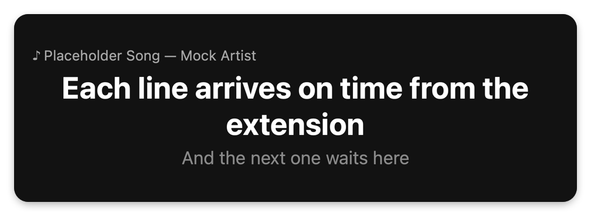
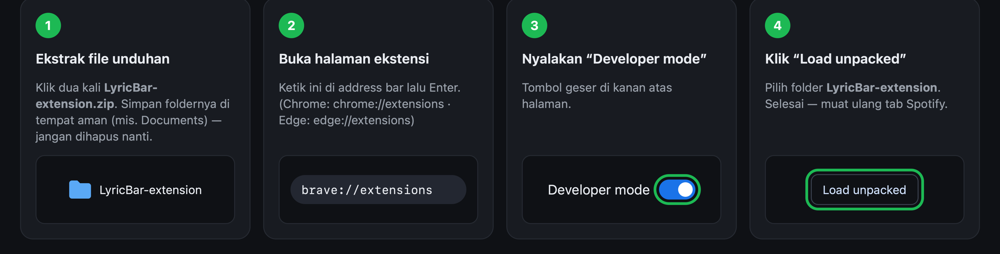
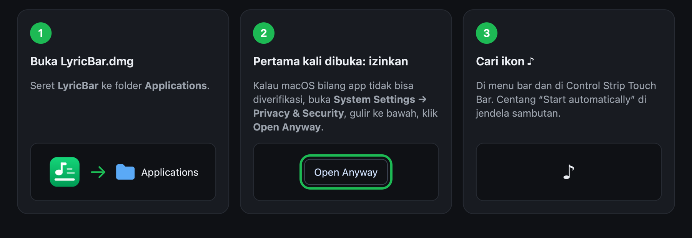
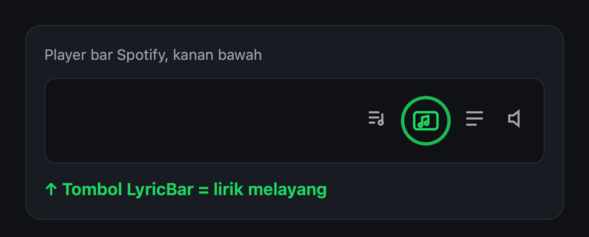
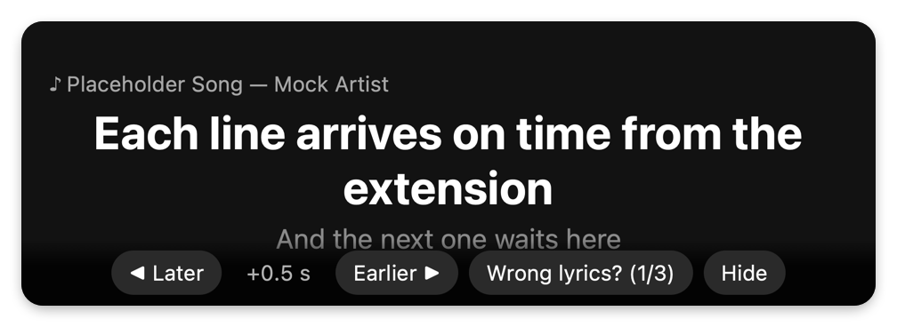
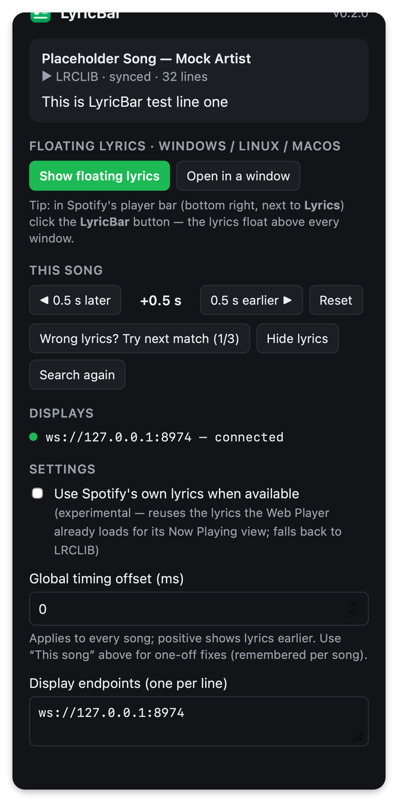

<p align="center"></p>

<h1 align="center">LyricBar</h1>

<p align="center"><a href="README.md">English</a> · <b>Bahasa Indonesia</b> · <a href="https://reihnxx.github.io/lyricbar/id/">Website</a></p>

<p align="center">
  <a href="https://github.com/reihnxx/lyricbar/releases/latest"></a>
  <a href="https://github.com/reihnxx/lyricbar/releases"></a>
  <a href="LICENSE"></a>
  <a href="https://reihnxx.github.io/lyricbar/"></a>
</p>

<p align="center">Lirik tersinkron dari <b>Spotify Web Player</b> — tampil di <b>Touch Bar</b> MacBook,<br>
atau di <b>jendela kecil melayang</b> di Windows, Linux, dan macOS.<br>
Gratis, tanpa login Spotify atau API key, tanpa perlu setting apa-apa.</p>

<p align="center"></p>
<p align="center"></p>

Mencari cara menampilkan **lirik Spotify di Touch Bar MacBook**, **lirik Spotify melayang yang
selalu di atas (always on top)**, atau **lirik tersinkron untuk Spotify Web Player** di Windows,
Linux, maupun macOS? Itulah LyricBar.

<sub>Screenshot memakai teks contoh.</sub>

---

## Bisa dipakai di mana?

| Komputer kamu | Yang ditampilkan LyricBar | Yang perlu dipasang |
|---|---|---|
| **Mac dengan Touch Bar** | Lirik di Touch Bar + menu bar + jendela melayang | Ekstensi browser **dan** app Mac |
| **Mac tanpa Touch Bar** | Jendela melayang (+ lirik di menu bar, opsional) | Ekstensi browser (app Mac opsional) |
| **Windows** / **Linux** | Jendela melayang yang selalu di atas jendela lain | Ekstensi browser saja |

Syaratnya: putar **Spotify** lewat browser di [open.spotify.com](https://open.spotify.com)
(gratis atau Premium), pakai **Brave, Google Chrome, Microsoft Edge, Arc, Opera, atau Vivaldi**.
Firefox dan Safari belum didukung.

---

## Cara pasang — sekitar 3 menit

### Langkah 1 · Pasang ekstensi browser (semua pengguna)

**[⬇ Unduh LyricBar-extension.zip](https://github.com/reihnxx/lyricbar/releases/latest/download/LyricBar-extension.zip)**



1. **Ekstrak** file yang diunduh (klik dua kali). Pindahkan folder **LyricBar-extension** ke
   tempat yang aman, misalnya *Documents*. Browser memuat ekstensi dari folder itu, jadi
   jangan dihapus nanti.
2. Buka halaman ekstensi: ketik **`brave://extensions`** di address bar lalu tekan Enter
   (Chrome: `chrome://extensions`, Edge: `edge://extensions`, Opera: `opera://extensions`).
3. Nyalakan **Developer mode** (tombol geser di kanan atas; di Edge ada di sebelah kiri).
4. Klik **Load unpacked**, lalu pilih folder **LyricBar-extension**.
5. Opsional: klik ikon puzzle 🧩 di toolbar, lalu **pin** LyricBar supaya gampang diakses.
6. Buka (atau muat ulang) [open.spotify.com](https://open.spotify.com) dan putar lagu.

> **Pengguna Windows / Linux: sudah selesai.** Lanjut ke [Lirik melayang](#lirik-melayang-windows-linux-macos).

### Langkah 2 · Pasang app Mac (untuk Touch Bar & menu bar)

**Cara A — paling gampang (1 baris, tanpa peringatan keamanan).** Buka app **Terminal**
(tekan ⌘ Spasi, ketik *Terminal*, Enter), tempel baris ini, lalu tekan Enter:

```sh
curl -fsSL https://raw.githubusercontent.com/reihnxx/lyricbar/main/scripts/install-macos.sh | bash
```

Perintah ini mengunduh LyricBar ke folder Applications lalu langsung menjalankannya.

**Cara B — cara biasa.**
**[⬇ Unduh LyricBar.dmg](https://github.com/reihnxx/lyricbar/releases/latest/download/LyricBar.dmg)**



1. Buka **LyricBar.dmg**, lalu seret **LyricBar** ke folder **Applications**.
2. Buka LyricBar dari Applications. Karena bukan dari App Store, macOS mungkin bilang app ini
   *tidak bisa diverifikasi*. Klik **Done**, lalu buka **System Settings → Privacy & Security**,
   gulir ke bawah dan klik **Open Anyway** (masukkan password kalau diminta). Cukup sekali saja.
3. Muncul jendela sambutan. Biarkan **“Start LyricBar automatically when I log in”** tercentang,
   supaya LyricBar otomatis jalan tiap Mac dinyalakan. Cari ikon **♪** di menu bar dan di
   Control Strip Touch Bar.

---

## Cara pakai

### Touch Bar (Mac)

Lirik muncul sendiri begitu lagu yang ada liriknya mulai diputar.


- **⊗** (kiri) mengembalikan Touch Bar ke tampilan normal.
- Tap **♪** hijau di Control Strip untuk memunculkan lirik lagi:

  

- Baris yang panjang akan bergeser (scroll) supaya bisa dibaca sampai habis:

  

### Lirik melayang (Windows, Linux, macOS)

Di player bar Spotify (kanan bawah, di sebelah tombol **Lyrics**), klik tombol **LyricBar**.
Jendela kecil akan terbuka dan **selalu berada di atas jendela lain**. Bisa diubah ukurannya,
digeser ke mana saja, dan ditutup kapan saja. Klik tombolnya lagi untuk menutup.



Arahkan mouse ke jendela itu untuk memperbaiki lirik lagu yang sedang diputar:



| Tombol | Fungsi |
|---|---|
| **◀ Later** | Lirik kecepetan → tampilkan 0,5 detik lebih lambat |
| **Earlier ▶** | Lirik telat → tampilkan 0,5 detik lebih cepat |
| **Wrong lyrics? (1/3)** | Lirik salah lagu → ganti ke versi lain |
| **Hide / Show** | Sembunyikan / tampilkan lirik untuk lagu ini |

Bisa juga dibuka dari popup ekstensi (**Show floating lyrics**). **Open in a window** membuka
jendela biasa; di dalamnya ada **📌 Keep on top** supaya jendelanya melayang di atas.

### Popup ekstensi

Klik ikon LyricBar di toolbar browser untuk melihat lagu yang diputar, memperbaiki lirik lagu ini,
dan mengubah pengaturan.



### Menu ♪ di menu bar (Mac)

| Menu | Fungsi |
|---|---|
| Show Lyrics on Touch Bar (⌘L) | Tampilkan / sembunyikan lirik di Touch Bar (✓ = sedang tampil) |
| *This Song* → Lyrics Are Late / Early (⌘] / ⌘[) | Geser timing 0,5 detik untuk lagu ini (diingat) |
| *This Song* → Wrong Lyrics? Try Next Match | Ganti ke versi lirik lain |
| *This Song* → Hide Lyrics / Search Lyrics Again | Sembunyikan lirik lagu ini / cari ulang |
| Auto-show When a Song Starts | Buka lirik di Touch Bar otomatis tiap lagu mulai |
| When a Song Has No Lyrics | Tampilkan nama lagu, atau kembali ke Touch Bar normal |
| Show Next Line · Show Lyrics in Menu Bar · Launch at Login | Pilihan tampilan |

---

## Kalau lirik tidak ada, salah, atau tidak pas waktunya

| Masalah | Yang dilakukan LyricBar | Yang bisa kamu lakukan |
|---|---|---|
| **Lirik tidak ada** | Menampilkan `♪ Judul — Artis · no lyrics found`<br> | Mac: *When a Song Has No Lyrics → Return to Normal Touch Bar*. Nanti coba *Search Lyrics Again* |
| **Lirik lagu lain** | Hanya memakai lirik yang judul, artis, **dan** durasinya cocok | **Wrong lyrics? / Try Next Match**, atau **Hide** — diingat untuk lagu itu |
| **Lirik kecepetan / telat** | — | **Earlier ▶ / ◀ Later** (per 0,5 detik), diingat per lagu. Offset untuk semua lagu ada di pengaturan popup |
| **Cuma ada lirik tanpa timing** | Baris dibagi rata sepanjang lagu dan ditandai `≈ unsynced`<br> | Geser timing, atau sumbang lirik tersinkron di [lrclib.net](https://lrclib.net) untuk semua orang |
| **Internet mati / situs lirik down** | Menampilkan *retrying…* dan mencoba lagi sendiri | **Search again** |

---

## Bantuan

<details>
<summary><b>Tombol LyricBar tidak muncul di Spotify</b></summary>

Muat ulang tab Spotify. Pastikan LyricBar dalam keadaan **aktif** di halaman ekstensi. Tombolnya ada
di sebelah tombol **Lyrics** milik Spotify; kalau jendela browser terlalu sempit, lebarkan sedikit.
Kamu juga selalu bisa pakai **Show floating lyrics** dari popup ekstensi.
</details>

<details>
<summary><b>Touch Bar / menu bar menampilkan “Waiting for browser extension”</b></summary>

App Mac dan ekstensi saling terhubung di dalam komputer kamu saja. Pastikan ekstensi sudah
terpasang (Langkah 1), tab Spotify terbuka, lalu muat ulang tab itu. Di popup ekstensi, bagian
**Displays** harus menunjukkan titik hijau.
</details>

<details>
<summary><b>Browser memberi peringatan soal “developer mode extensions”</b></summary>

Itu normal untuk ekstensi yang dipasang dari folder (bukan dari web store). Boleh ditutup saja.
Semua kode LyricBar ada di repository ini.
</details>

<details>
<summary><b>Cara update</b></summary>

- **Ekstensi:** unduh zip terbaru, ganti isi folder **LyricBar-extension**, lalu klik tombol
  ↻ (reload) di kartu LyricBar pada halaman ekstensi.
- **App Mac:** jalankan lagi perintah 1 baris di atas, atau seret versi baru dari DMG.
</details>

<details>
<summary><b>Cara uninstall</b></summary>

- **Ekstensi:** halaman ekstensi → LyricBar → **Remove**, lalu hapus foldernya.
- **App Mac:** menu ♪ → **Quit LyricBar**, seret *LyricBar* dari Applications ke Trash, lalu
  hapus dari *System Settings → General → Login Items*.
</details>

<details>
<summary><b>Aman nggak? Data apa yang dipakai?</b></summary>

- Hanya judul lagu, artis, album, dan durasi yang dikirim ke [lrclib.net](https://lrclib.net) untuk mencari lirik.
- Ekstensi hanya berjalan di open.spotify.com. Tidak pernah membaca password, cookie, atau token Spotify kamu.
- App Mac hanya menerima koneksi dari komputer kamu sendiri.
- Tanpa akun, tanpa iklan, tanpa pelacakan. Semua kode open source (MIT).
</details>

---

## Sumber lirik

| Sumber | Default | Catatan |
|---|---|---|
| [LRCLIB](https://lrclib.net) | ✅ | Database lirik komunitas yang gratis dan tersinkron. Lagu yang belum ada bisa ditambahkan siapa saja. |
| Spotify (eksperimental) | mati | Nyalakan di popup. Memakai lirik yang sudah dimuat Web Player untuk tampilan Now Playing; LyricBar **tidak** mengirim request tambahan ke Spotify. Kalau gagal, otomatis pakai LRCLIB. Mungkin melanggar Ketentuan Penggunaan Spotify — gunakan dengan pertimbangan sendiri. |

## Untuk developer

Build dari source, menambah tampilan baru (taskbar Windows, panel Linux, Stream Deck…), atau
memperbaiki sesuatu: lihat [CONTRIBUTING.md](CONTRIBUTING.md), [docs/PROTOCOL.md](docs/PROTOCOL.md),
dan [docs/ARCHITECTURE.md](docs/ARCHITECTURE.md).

```sh
npm test                      # tes ekstensi (Node ≥ 22)
scripts/build-macos.sh        # dist/LyricBar.app + LyricBar.dmg (cukup Xcode Command Line Tools)
scripts/package-extension.sh  # dist/LyricBar-extension.zip
node scripts/mock-sender.mjs  # lirik palsu untuk mencoba tampilan tanpa Spotify
```

Rilis dibuat otomatis setiap ada tag `v*` yang di-push (`.github/workflows/release.yml`).

## Disclaimer

LyricBar tidak berafiliasi dengan Spotify maupun LRCLIB. Lirik adalah milik pemegang haknya;
LyricBar hanya menampilkannya untuk penggunaan pribadi, dan repository ini tidak menyimpan lirik
apa pun. App Mac memakai API Touch Bar privat (sama seperti aplikasi Touch Bar lainnya) yang bisa
saja diubah oleh Apple.

## Lisensi

[MIT](LICENSE)
