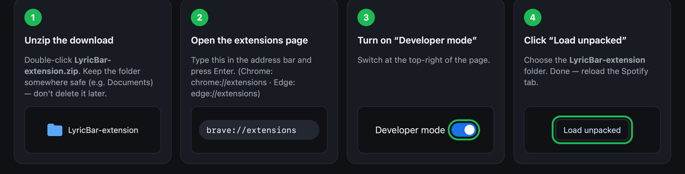
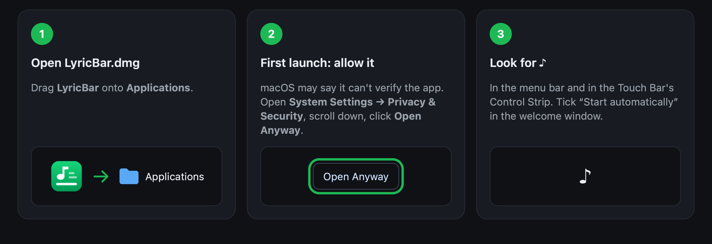
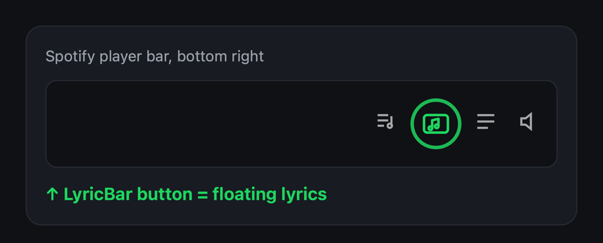

<p align="center"></p>

<h1 align="center">LyricBar</h1>

<p align="center"><b>English</b> · <a href="README.id.md">Bahasa Indonesia</a></p>

<p align="center">Synced lyrics from the <b>Spotify Web Player</b> — on your MacBook <b>Touch Bar</b>,<br>
or in a small <b>floating window</b> on Windows, Linux and macOS.<br>
Free, no Spotify login or API keys, nothing to configure.</p>

<p align="center"></p>
<p align="center"></p>

<sub>Screenshots use placeholder text.</sub>

---

## What you get

| Your computer | What LyricBar shows | What to install |
|---|---|---|
| **Mac with Touch Bar** | Lyrics across the Touch Bar + menu bar + floating window | Browser extension **and** the Mac app |
| **Mac without Touch Bar** | Floating window (+ optional lyrics in the menu bar) | Browser extension (Mac app optional) |
| **Windows** / **Linux** | Floating window that stays on top of other windows | Browser extension only |

You need: **Spotify** played in the browser at [open.spotify.com](https://open.spotify.com)
(free or Premium), in **Brave, Google Chrome, Microsoft Edge, Arc, Opera or Vivaldi**.
Firefox and Safari aren't supported yet.

---

## Install — about 3 minutes

### Step 1 · Add the browser extension (everyone)

**[⬇ Download LyricBar-extension.zip](https://github.com/reihnxx/lyricbar/releases/latest/download/LyricBar-extension.zip)**



1. **Unzip** the download (double-click it). Move the **LyricBar-extension** folder somewhere
   you'll keep it, e.g. *Documents*. The browser loads it from there, so don't delete it later.
2. Open your browser's extensions page: type **`brave://extensions`** in the address bar and
   press Enter (Chrome: `chrome://extensions`, Edge: `edge://extensions`, Opera: `opera://extensions`).
3. Turn on **Developer mode** (switch at the top right; in Edge it's on the left).
4. Click **Load unpacked** and choose the **LyricBar-extension** folder.
5. Optional: click the puzzle-piece icon 🧩 in the toolbar and **pin** LyricBar.
6. Open (or reload) [open.spotify.com](https://open.spotify.com) and play a song.

> **Windows / Linux users: you're done.** Jump to [Floating lyrics](#floating-lyrics-windows-linux-macos).

### Step 2 · Install the Mac app (for the Touch Bar & menu bar)

**Option A — easiest (one line, no security prompts).** Open the **Terminal** app
(press ⌘ Space, type *Terminal*, Enter), paste this line, press Enter:

```sh
curl -fsSL https://raw.githubusercontent.com/reihnxx/lyricbar/main/scripts/install-macos.sh | bash
```

It downloads LyricBar into your Applications folder and starts it.

**Option B — the usual way.**
**[⬇ Download LyricBar.dmg](https://github.com/reihnxx/lyricbar/releases/latest/download/LyricBar.dmg)**



1. Open **LyricBar.dmg** and drag **LyricBar** onto **Applications**.
2. Open LyricBar from Applications. Because the app isn't from the App Store, macOS may say it
   *can't verify* it. Click **Done**, then open **System Settings → Privacy & Security**, scroll
   down and click **Open Anyway** (enter your password if asked). You only do this once.
3. A welcome window appears. Keep **“Start LyricBar automatically when I log in”** ticked.
   Look for **♪** in the menu bar and in the Touch Bar's Control Strip.

---

## Using it

### Touch Bar (Mac)

Lyrics appear by themselves when a song with lyrics starts.


- **⊗** (left) puts your normal Touch Bar back.
- Tap the green **♪** in the Control Strip to bring the lyrics back:

  

- Long lines scroll so you can read them to the end:

  

### Floating lyrics (Windows, Linux, macOS)

In Spotify's player bar (bottom right, next to the **Lyrics** button) click the **LyricBar** button.
A small window opens that **stays on top of every other window**. Resize it, drag it anywhere,
close it any time. Click the button again to close it.



Move your mouse over the window to fix things for the current song:


| Button | What it does |
|---|---|
| **◀ Later** | Lyrics too early → show them 0.5 s later |
| **Earlier ▶** | Lyrics too late → show them 0.5 s earlier |
| **Wrong lyrics? (1/3)** | Lyrics belong to another song → switch to another version |
| **Hide / Show** | Hide / show lyrics for this song |

You can also open it from the extension's popup (**Show floating lyrics**). **Open in a window**
gives a normal window; inside it, **📌 Keep on top** makes it float.

### The extension popup

Click the LyricBar icon in the browser toolbar to see what's playing, fix the current song, and change settings.


### The menu bar ♪ (Mac)

| Menu item | What it does |
|---|---|
| Show Lyrics on Touch Bar (⌘L) | Show or hide lyrics on the Touch Bar (✓ = showing) |
| *This Song* → Lyrics Are Late / Early (⌘] / ⌘[) | Shift timing by 0.5 s for this song (remembered) |
| *This Song* → Wrong Lyrics? Try Next Match | Switch to another lyrics version |
| *This Song* → Hide Lyrics / Search Lyrics Again | Hide lyrics for this song / look them up again |
| Auto-show When a Song Starts | Open the Touch Bar lyrics automatically |
| When a Song Has No Lyrics | Show the song name, or go back to your normal Touch Bar |
| Show Next Line · Show Lyrics in Menu Bar · Launch at Login | Display options |

---

## When lyrics are missing, wrong or out of sync

| Problem | What LyricBar does | What you can do |
|---|---|---|
| **No lyrics** for the song | Shows `♪ Title — Artist · no lyrics found`<br> | Mac: *When a Song Has No Lyrics → Return to Normal Touch Bar*. Later: *Search Lyrics Again* |
| **Wrong song's lyrics** | Only accepts lyrics whose title, artist **and** length match | **Wrong lyrics? / Try Next Match**, or **Hide** — remembered for that song |
| **Lyrics early / late** | — | **Earlier ▶ / ◀ Later** (0.5 s steps), remembered per song. A global offset is in the popup's settings |
| **Only unsynced lyrics exist** | Spreads lines over the song and marks them `≈ unsynced`<br> | Shift timing, or add synced lyrics at [lrclib.net](https://lrclib.net) for everyone |
| **No internet / lyrics site down** | Shows *retrying…* and retries by itself | **Search again** |

---

## Help

<details>
<summary><b>The LyricBar button doesn't appear in Spotify</b></summary>

Reload the Spotify tab. Make sure LyricBar is switched **on** in your extensions page. The button
sits next to Spotify's own **Lyrics** button; if your window is very narrow, make it wider.
You can always use **Show floating lyrics** in the extension popup instead.
</details>

<details>
<summary><b>The Touch Bar / menu bar says “Waiting for browser extension”</b></summary>

The Mac app and the extension talk to each other on your computer only. Check that the extension
is installed (Step 1), that a Spotify tab is open, and reload that tab. In the extension popup,
**Displays** should show a green dot.
</details>

<details>
<summary><b>My browser warns about “developer mode extensions”</b></summary>

That's normal for extensions installed from a folder instead of a web store. You can dismiss it.
LyricBar's code is all in this repository.
</details>

<details>
<summary><b>How do I update?</b></summary>

- **Extension:** download the new zip, replace the contents of your **LyricBar-extension**
  folder, then click the ↻ reload button on LyricBar in the extensions page.
- **Mac app:** run the one-line installer again, or drag the new version from the DMG.
</details>

<details>
<summary><b>How do I uninstall?</b></summary>

- **Extension:** extensions page → LyricBar → **Remove**, then delete the folder.
- **Mac app:** ♪ menu → **Quit LyricBar**, drag *LyricBar* from Applications to the Trash, and
  remove it from *System Settings → General → Login Items*.
</details>

<details>
<summary><b>Is it safe? What data does it use?</b></summary>

- Only the song title, artist, album and length are sent to [lrclib.net](https://lrclib.net) to find lyrics.
- The extension only runs on open.spotify.com. It never reads your Spotify password, cookies or tokens.
- The Mac app only accepts connections from your own computer.
- No accounts, no ads, no tracking. All code is open source (MIT).
</details>

---

## Lyrics sources

| Source | Default | Notes |
|---|---|---|
| [LRCLIB](https://lrclib.net) | ✅ | Free community lyrics database, time-synced. Missing songs can be added by anyone. |
| Spotify (experimental) | off | Turn on in the popup. Reuses the lyrics the Web Player already loads for its Now Playing view; LyricBar makes **no extra requests** to Spotify. Falls back to LRCLIB. May be against Spotify's Terms of Use — your choice. |

## For developers

Build from source, add new displays (Windows taskbar, Linux bars, Stream Deck…) or fix things:
see [CONTRIBUTING.md](CONTRIBUTING.md), [docs/PROTOCOL.md](docs/PROTOCOL.md) and
[docs/ARCHITECTURE.md](docs/ARCHITECTURE.md).

```sh
npm test                      # extension tests (Node ≥ 22)
scripts/build-macos.sh        # dist/LyricBar.app + LyricBar.dmg (Xcode Command Line Tools is enough)
scripts/package-extension.sh  # dist/LyricBar-extension.zip
node scripts/mock-sender.mjs  # fake lyrics to try displays without Spotify
```

Releases are built automatically when a `v*` tag is pushed (`.github/workflows/release.yml`).

## Disclaimer

LyricBar is not affiliated with Spotify or LRCLIB. Lyrics belong to their rights holders;
LyricBar only displays them for personal use, and this repository contains none. The Mac app uses
private Touch Bar APIs (like other Touch Bar tools), which Apple could change.

## License

[MIT](LICENSE)
